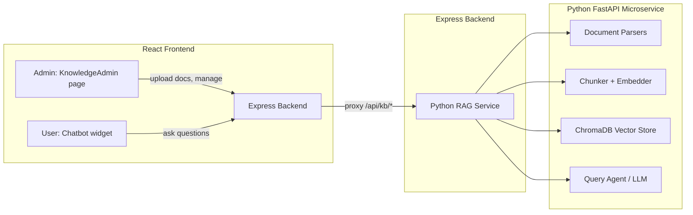

# Knowledge System — Integrated into NeuroBridge

Integrate a RAG (Retrieval-Augmented Generation) knowledge engine into the existing NeuroBridge platform. **Admin** uploads documents to grow the knowledge base. **Users** ask questions via a chatbot that answers from the stored knowledge.

## Architecture Overview



**Two processes run side-by-side:**
1. **Existing Express backend** (port 3005) — gets new proxy routes to forward KB requests
2. **New Python microservice** (port 8100) — handles all doc parsing, embedding, storage, and RAG querying

---

## User Review Required

> [!IMPORTANT]
> **LLM Provider**: Uses OpenAI (`text-embedding-3-small` + `gpt-4o-mini`). The `OPENAI_API_KEY` in your existing [.env](file:///Users/jeetkarsh/Downloads/Autism/neurobridge/backend/.env) will be shared. Want a different model?

> [!IMPORTANT]
> **Python Microservice**: The RAG engine runs as a separate Python FastAPI process on port 8100. The Express backend proxies to it. This avoids polluting the TS codebase with heavy ML dependencies.

---

## Proposed Changes

### 1. Python RAG Microservice

All Python code lives in `neurobridge/knowledge_engine/`.

```
knowledge_engine/
├── main.py                     # FastAPI app
├── config.py                   # Env vars, constants
├── requirements.txt
├── .env.example
├── data/
│   └── chroma_db/              # Persistent vector storage
├── parsers/
│   ├── __init__.py
│   ├── base.py                 # BaseParser + ParserFactory
│   ├── pdf_parser.py           # PyMuPDF
│   ├── docx_parser.py          # python-docx
│   ├── pptx_parser.py          # python-pptx
│   ├── xlsx_parser.py          # openpyxl
│   ├── text_parser.py          # TXT + Markdown
│   └── url_parser.py           # trafilatura
├── core/
│   ├── __init__.py
│   ├── models.py               # Pydantic: ParsedSection, Chunk, QueryResult
│   ├── chunker.py              # Semantic chunking (300-700 tokens, overlap)
│   ├── embedder.py             # OpenAI batch embeddings + cache
│   └── hasher.py               # SHA256 file dedup
├── storage/
│   ├── __init__.py
│   └── vector_store.py         # ChromaDB wrapper
└── agents/
    ├── __init__.py
    ├── indexing_agent.py        # Parse → chunk → embed → store pipeline
    └── query_agent.py           # Hybrid retrieval + LLM answer with sources
```

#### Key endpoints (FastAPI, port 8100):

| Endpoint | Method | Description |
|----------|--------|-------------|
| `/ingest/file` | POST | Accept uploaded file, process and store |
| `/ingest/url` | POST | Accept URL, scrape and store |
| `/query` | POST | RAG query → answer + sources |
| `/documents` | GET | List all ingested documents |
| `/documents/{doc_id}` | DELETE | Remove document and its chunks |
| `/health` | GET | Service health + stats |

---

### 2. Express Backend Changes

#### [MODIFY] [server.ts](file:///Users/jeetkarsh/Downloads/Autism/neurobridge/backend/src/server.ts)
- Import and mount new `kbRoutes` at `/api/kb`
- Add `multer` for file upload handling

#### [NEW] [kb.ts](file:///Users/jeetkarsh/Downloads/Autism/neurobridge/backend/src/routes/kb.ts)
Proxy routes that forward requests from the frontend to the Python microservice:
- `POST /api/kb/ingest/file` → multipart upload → forward file to Python `/ingest/file`
- `POST /api/kb/ingest/url` → forward URL to Python `/ingest/url`
- `POST /api/kb/query` → forward question to Python `/query`
- `GET /api/kb/documents` → proxy to Python `/documents`
- `DELETE /api/kb/documents/:id` → proxy to Python `/documents/:id`
- All routes require [authenticateToken](file:///Users/jeetkarsh/Downloads/Autism/neurobridge/backend/src/middleware/auth.ts#8-20) + admin check

#### [MODIFY] [schema.prisma](file:///Users/jeetkarsh/Downloads/Autism/neurobridge/backend/prisma/schema.prisma)
Add `role` field to `User` model:
```prisma
model User {
  ...
  role      String   @default("user") // "admin" or "user"
}
```

#### [NEW] [adminAuth.ts](file:///Users/jeetkarsh/Downloads/Autism/neurobridge/backend/src/middleware/adminAuth.ts)
Middleware that checks `user.role === "admin"` for KB management routes.

---

### 3. Frontend — Admin Knowledge Management Page

#### [NEW] [KnowledgeAdmin.tsx](file:///Users/jeetkarsh/Downloads/Autism/neurobridge/frontend/src/pages/KnowledgeAdmin.tsx)
Admin-only page with:
- **Upload zone** — drag-and-drop or click to upload PDF, DOCX, PPTX, XLSX, TXT, MD files
- **URL ingestion** — input field to submit web links
- **Document list** — table showing all ingested docs (name, type, date, chunks count) with delete action
- **Processing status** — real-time feedback when a doc is being ingested
- Shows only for admin users

#### [NEW] [Chatbot.tsx](file:///Users/jeetkarsh/Downloads/Autism/neurobridge/frontend/src/components/Chatbot.tsx)
Floating chatbot widget available on all authenticated pages:
- Expandable bubble icon in bottom-right corner
- Chat interface with message history
- Sends questions to `/api/kb/query`
- Displays AI answer with source citations
- Clean, modern design matching NeuroBridge theme

#### [MODIFY] [App.tsx](file:///Users/jeetkarsh/Downloads/Autism/neurobridge/frontend/src/App.tsx)
- Add route `/admin/knowledge` → `KnowledgeAdmin`
- Render `<Chatbot />` inside `PlatformLayout`

#### [MODIFY] [Sidebar.tsx](file:///Users/jeetkarsh/Downloads/Autism/neurobridge/frontend/src/components/Sidebar.tsx)
- Add "Knowledge Admin" nav item (shown only to admin users) with a `Database` icon

#### [MODIFY] [PlatformLayout.tsx](file:///Users/jeetkarsh/Downloads/Autism/neurobridge/frontend/src/components/PlatformLayout.tsx)
- Include `<Chatbot />` component so it appears on all pages

---

## Verification Plan

### Automated Tests
1. Start Python service: `cd knowledge_engine && pip install -r requirements.txt && python main.py`
2. Test health: `curl http://localhost:8100/health`
3. Ingest a test text file: `curl -X POST -F "file=@test.txt" http://localhost:8100/ingest/file`
4. Query: `curl -X POST -H "Content-Type: application/json" -d '{"question":"test"}' http://localhost:8100/query`

### Manual Verification
1. Start both services (Express on 3005, Python on 8100)
2. Login as admin → navigate to Knowledge Admin → upload a PDF → verify it appears in the document list
3. Login as regular user → open the chatbot → ask a question about the uploaded document → verify the answer is grounded and cites the source
4. Verify non-admin users **cannot** access the admin page
